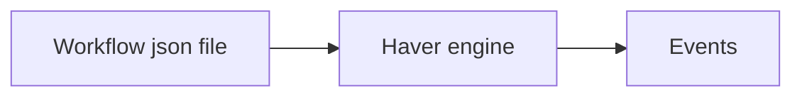

# Haver

Haver is a microflow engine.  
The engine ingests a JSON workflow definition and executes it.

## Workflow Definition

A workflow JSON definition is composed of `name`, `input` and `steps`:

- **name** – the name of the workflow
- **input** – a JSON object representing the workflow input
- **steps** – an ordered list of steps that the engine will execute

Refer to the `sample` folder for example workflow definitions.

### Step Types

- **Start** – every workflow must contain exactly one `Start` step
- **End** – marks the termination of the workflow
- **Command** – executes an operation / logic block, takes input and returns output as a JSON object
- **Condition** – evaluates a given condition and determines the next step based on the result

## TODO

Cron scheduler
Copy File
Zip File
UnZip
Tar File
UnTar
List Dir
Walk Dir
Parse HTML
Parse XML
Parse YML
Script
